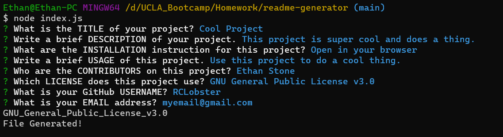
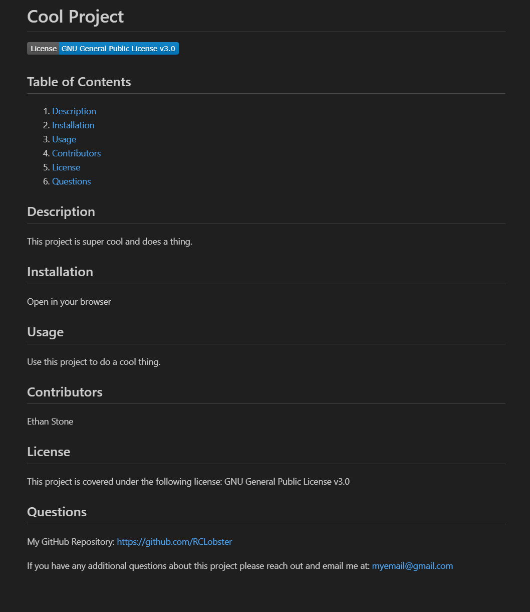

# readme-generator

## Description
This program lets the user generate a readme file dynamically after asking a few questions. This program runs in the terminal using node.js

Questions in the terminal:

Generated file:

GitHub Repo: https://github.com/RCLobster/readme-generator

## Installation
N/A

## Usage
Use this program to dynamically generate a readme by answering questions.

## Contributors
Ethan Stone

## License
N/A